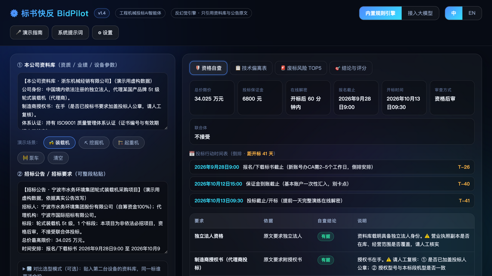
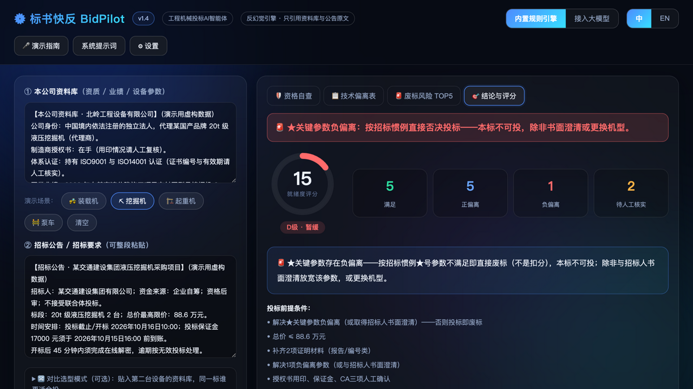
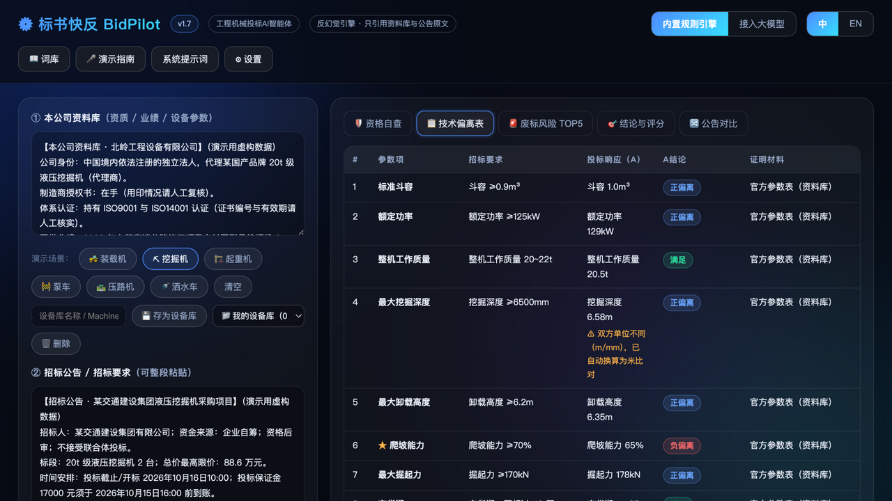

# 标书快反 BidPilot

[](https://github.com/azzb66223944qq/bidpilot/actions/workflows/test.yml)

工程机械投标文件 AI 智能体（**v2.1.1**）。输入**本公司资料库** + **招标公告**，10 秒生成四份投标必备成果：

> 🌐 **在线体验（已上线）：<https://azzb66223944qq.github.io/bidpilot/>**

1. 🛡 **资格自查** —— 逐条对照招标资格要求：能投 / 缺什么 / 需人工核实项
2. 📋 **技术偏离表** —— 逐条响应招标参数，标注 `满足 / 正偏离 / 负偏离 / 资料库无 / 待人工补充`
3. 🚨 **废标风险 TOP5** —— 给业务员看的白话版提醒（解密时限、同网络串标、保证金、授权书用印、限价与截止时间）
4. 🎯 **结论与评分** —— **投标就绪度评分（0-100）**动态评分环 + A/B/C/D 等级 + 是否建议投标 + 前提条件清单

## v2.1.1 新增（导出一致性与资产可携带）

- **导出一致性**：HTML/MD报告偏离表补齐"置信"列（●高/◐中），与网页完全一致；报告尾注含**报告指纹**，与审计日志互相锚定
- **📦 资产包导入导出**：词库+设备库+权重+偏好一键打包JSON（不含API密钥），团队共享/换机迁移不丢资产
- **破坏性操作二次确认**：词库清空、设备库删除前需确认
- **雷达图标签防遮挡** + 对比模式B设备置信标记

## v2.1 新增（从公告到采购文件）

- **📄 采购文件PDF导入**：拖入招标文件附件PDF，本地pdf.js解析（不上传服务器）自动定位"技术参数"章节并附加到公告区——参数不再需要手动复制粘贴；扫描件诚实提示无法解析
- **A/B对比雷达图**：对比模式新增多轴雷达，两台设备的多边形叠加，形状差异一眼可见
- **黄金快照测试**：6组"输入→完整输出"面级回归快照，防隐形改动破坏行为；CI双测试（断言+快照）
- **章节定位引擎**：新增locateParamSection（Chapter locate），识别"第三章技术参数/第四章评标办法"等章节边界

## v2.0 新增（看得见的严谨·当前线上版本）

- **🔍 原文批注视图**：新标签页把招标公告原文渲染出来，每条判定就地高亮（★金/▲蓝/负偏离红/正偏离浅蓝/满足绿/待核实橙），悬停查看判定依据——"结论可回溯"从承诺变成可视化体验
- **判定置信度分级**：偏离表新增"置信"列（●高=精确关键词命中 / ◐中=词库别名匹配），诚实标注每个判定的确信程度
- **🧾 审计日志**：每次分析自动留痕（时间/引擎版本/输入指纹/评分/词库状态），结论页展示最近8次，支持JSON导出——"当时的判断永远可以复现"
- **报告品牌系统**：设置上传公司Logo+选择主题色（5色），导出的HTML报告自动套用——每家经销商拿到的是"自己的报告"
- **CI自动测试**：GitHub Actions每次push自动运行全部断言，README顶部通过徽章即质检盖章
- 引擎引用带版本参数，彻底解决浏览器缓存旧版问题

## v1.7 新增

- **品类扩展 16→32 类**（依据 ccgp 真实公告研究）：新增道路机械（激振力/振动频率/压实宽度/摊铺宽度/铣刨宽度/铣刨深度）、环卫车辆（罐体容积/压缩容积）、土方（铲刀容量/接地比压）、起重搬运（起升高度/额定载荷）、基础工程（钻孔直径/钻孔深度/输出扭矩）、高空作业（作业高度），机型族扩展至 7 大类
- **▲重要条款识别**：真实采购文件中 ▲ 标注影响评分（区别于 ★ 否决条款），▲负偏离/缺失触发琥珀前提警示但不判废标——★/▲ 双体系分级风控
- **交货期新措辞**：支持"合同履行期限：自签订之日起X天内完成供货"等政采真实表述
- **容积单位**：罐体/压缩容积支持 L/升↔m³ 自动换算
- **新演示场景**：🛣 压路机（94/A）· 🚿 洒水车（★负偏离15/D）
- **PWA缓存策略再修正**：全部资源网络优先，彻底解决"更新到不了浏览器"问题

## v1.6 新增

- **公告变更检测（🔀 公告对比）**：把澄清/补遗前后的两版公告贴进去，自动对比并按风险分级列出全部变更——限价调整、保证金变化、开标时间变更、参数要求修改、★标注新增/取消、证明材料增删，每条附"怎么办"建议；内置"载入对比演示"一键体验
- **自定义词库（📖 词库）**：遇到引擎不认识的设备表述（如"额定容积"指斗容），登记别名到对应参数，规则库即随使用生长；匹配时在偏离表诚实标注"依自定义词库匹配"，可随时删除，词库存本机
- **PWA缓存策略修正**：页面改为网络优先（更新及时到达），静态资源缓存优先（离线可用），缓存版本化自动清理

## v1.5 新增

- **★关键参数缺失告警**：★参数在资料库中找不到时，结论页亮琥珀色警告条（区别于负偏离的废标红条）——"未确认前不具备投标条件"，结论与前提同步提示
- **对比报告导出补全**：对比模式下的 MD/HTML 导出报告新增"对比分析"章节（A/B 评分对照表+B设备结论+选型建议），HTML 报告偏离表自动扩展 A/B 双列
- **我的设备库**：常用设备资料库一键存本机（最多30个），下拉即载入，经销商重复投标不用反复粘贴
- **Ctrl/⌘ + Enter 快捷运行**：输入框内直接触发分析

## v1.4 新增

- **★关键参数识别与废标判定**：自动识别招标文件中★号标注（段级定位，★只归属紧邻参数），★参数负偏离→评分压至15分/D级+全页废标红条+"书面澄清或更换机型"前提——这是真实招标规则（★参数不满足=否决投标），不是普通扣分
- **投标行动时间表**：从公告提取报名截止/保证金到账/开标时间，自动生成倒排行动计划（T-26/T-40/T-41），速览卡显示"距开标X天"倒计时
- **报告抬头公司名称**：⚙设置填公司名，导出的HTML/MD报告带抬头
- 四个演示场景日期更新为未来时间，倒计时真实可用

## v1.3 新增

- **四种机型演示场景**：🚜装载机（94/A）· ⛏挖掘机（79/B）· 🏗起重机（94/A，含起重力矩/起重量参数）· 🚧泵车（64/C，含泵送方量/臂架高度参数）——覆盖A/B/C三个结论档位
- **引擎新增4类参数**：最大额定起重量、额定起重力矩、理论泵送方量、臂架高度（共16类）
- **评分权重可配置**：⚙设置中调节负偏离/缺参数/待核对/缺证明四项扣分权重，保存即重新分析；权重会改变结论（泵车从64/C变88/A），权重脚注随报告输出——"权重=业务价值观"
- **中英文界面切换**：右上角 中/EN，全Chrome文案切换（分析结果与动态提示保持中文），偏好存本机

## v1.2 新增

- **对比选型模式**：贴入第二台设备的资料库，同一标双评分环对决（A 94分A级别 VS B 5分D级），偏离表自动扩展A/B双列，输出一行选型建议
- **项目速览卡**：限价/保证金/解密时限/报名截止/开标时间/审查方式/联合体，7张卡片一屏速览，未检索到的自动黄标提醒
- **一键复制补料清单**：把所有"待人工核实/资料库无"项整理成可转发的清单，直接发给制造商或同事照单补料
- **导出HTML报告**：单文件带样式报告（含静态评分环），微信/邮件可直接转发，浏览器打开即可打印

## v1.1 特性

- **投标就绪度评分**：100 − 15×负偏离 − 6×缺参数 − 5×待核对 − 3×缺证明，自动归为 A（≥85 建议投标）/ B（70-84 补料后可投）/ C（55-69 谨慎）/ D（<55 暂缓）
- **双演示场景**：🚜 装载机（94分A级，可投标）与 ⛏ 挖掘机（★爬坡负偏离→废标级15分D，"敢于说不"），一组正例一组反例，答辩时展示工具"敢于说不"
- **单位自动换算**：mm↔m、马力↔kW（1马力=0.7355）、吨↔kg，跨单位照样精确比对；口径确实冲突的（爬坡 % vs °、掘起力 kN vs 吨）不做瞎换算，标"待人工核对"
- **历史记录**：每次分析存本机 localStorage（最近20条），点击即载入重跑
- **打印/导出PDF**：打印样式自动隐藏输入区，输出白底黑字报告页
- **演示指南**：右上角"🎤 演示指南"内置三分钟答辩演示脚本

## 核心设计：反幻觉铁律

本工具只允许使用用户提供的两份输入作答。任何一方缺失的信息，一律输出：

> 该信息不在本公司资料库中，请核实后补充

**绝不编造**品牌、机型、参数、业绩、资质、报告编号。这是工程机械投标场景的合规刚需——编一个参数就是废标+法律风险。

内置演示数据（浙东机械/北岭设备）均为**虚构**，仅用于演示。

## 产品截图

| 资格自查页（速览卡+行动时间表·距开标41天） | 挖掘机场景（★关键参数负偏离→废标红条·15分/D级） |
|---|---|
|  |  |

技术偏离表（★仅标记爬坡能力=段级定位；注意第4行 6.58m vs ≥6500mm 跨单位自动换算）：

## 参赛文档

- [docs/Defense-QA.md](docs/Defense-QA.md) —— 评委10问+回答话术
- [docs/BP-Outline.md](docs/BP-Outline.md) —— 按评审维度组织的BP大纲（含12页PPT映射）
- [prompts/system-prompt.md](prompts/system-prompt.md) —— Coze/Dify 部署用系统提示词

## PWA：把标书快反"装"成 App

本项目已支持 PWA（渐进式 Web 应用）——通过 http/https 访问时（本地 `python3 -m http.server` 或 GitHub Pages），可以一键安装为独立 App：

- **macOS / Windows（Chrome/Edge）**：地址栏右侧会出现"安装"图标 → 点击 → 桌面/启动台出现"标书快反"独立窗口应用
- **安卓（Chrome）**：菜单 →"添加到主屏幕"→ 变成带图标的App，独立窗口运行
- **iOS（Safari）**：分享 →"添加到主屏幕"→ 同上

安装后**完全离线可用**（Service Worker 已缓存应用外壳），App 图标为品牌视觉（深蓝底+青色评分环+"快"字）。

> 注意：直接双击 index.html（file:// 方式）不加载 Service Worker 与清单，但应用本身依然离线可用——PWA 仅是锦上添花的"App化"包装。

## 运行方式

### 方式一：本地直接打开（最快）

双击 `index.html` 即可，内置规则引擎**离线可用**，无需任何安装。

### 方式二：GitHub Pages 部署（可放进参赛材料链接）

```bash
git init && git add . && git commit -m "BidPilot v1.5"
git remote add origin https://github.com/<你的用户名>/bidpilot.git
git push -u origin main
# 仓库 Settings → Pages → main 分支根目录 → https://<用户名>.github.io/bidpilot/
```

### 方式三：接入真实大模型（变成完整智能体）

1. 到 [智谱开放平台 open.bigmodel.cn](https://open.bigmodel.cn) 注册并领取 API Key（`glm-4-flash` 免费档即可）
2. 打开页面 → 右上角 **⚙ 设置** → 粘贴 Key → 保存（Key 仅存本机浏览器）
3. 右上角切换到 **接入大模型** → 点"生成投标分析"

> 若浏览器直连遇 CORS 限制：改用方式四，或切回内置规则引擎。

### 方式四：部署到 Coze / Dify（推荐参赛演示）

点右上角 **系统提示词** 一键复制，粘贴到 [coze.cn](https://www.coze.cn) 新建智能体的"人设与回复逻辑"，再把资料上传为知识库。参见 [prompts/system-prompt.md](prompts/system-prompt.md)。

## 引擎能力（内置规则引擎 v1.5）

| 能力 | 说明 |
|---|---|
| 参数解析 | 12 类参数：载重/斗容/功率/整机质量/挖掘深度/卸载高度/爬坡/掘起力/行走速度/动臂时间/交货期/质保；识别 `≥5000kg`、`≤18t`、`20~22t`、`不超过30天`、`不低于1年`、`半年`、`国四` 等写法 |
| 偏离判定 | 下限型超限=**正偏离**；上限型达标=**满足**；不达标=**负偏离**；双方均未提及的参数不产生噪音行 |
| 单位换算 | mm↔m、马力↔kW、吨↔kg；口径冲突（%/°、kN/吨）标待人工核对，不瞎换算 |
| 元信息提取 | 最高限价、保证金、解密分钟数、报名/开标时间、资格后审、联合体条款 |
| 评分模型 | 见"v1.2 新增"首条，评分随参数完备度实时变化 |

运行测试（142 项断言，四机型场景+单位换算+权重配置+HTML报告+补料清单+黄金快照，见 `tests/engine.test.js` 与 `tests/golden.test.js`）：

```bash
node tests/engine.test.js
```

## 文件结构

```
bidpilot/
├── index.html            # 前端应用（评分环/对比选型/速览卡/权重面板/中英界面/PWA）
├── manifest.json / sw.js / icon-*.png  # PWA 清单、离线缓存与App图标
├── engine.js             # 核心解析引擎 v1.5（纯函数，浏览器/Node 通用）
├── tests/
│   ├── engine.test.js    # 142 项自动化断言（node tests/engine.test.js）
    │   └── golden.json         # 6 组黄金快照基线
├── docs/
│   ├── Defense-QA.md         # 评委10问+话术
│   ├── BP-Outline.md         # BP大纲（含PPT页面映射）
│   └── screenshots/           # 产品验收截图
├── prompts/
│   └── system-prompt.md  # 智能体系统提示词（Coze/Dify/GLM 通用）
└── README.md
```

## 参赛使用提示（"AI+工程机械"专业赛 · AI+运营方向）

- 三分钟演示脚本已内置在页面右上角"🎤 演示指南"
- 答辩强调三点差异：**① 反幻觉合规设计**（投标场景编造=废标）；**② 结论可回溯**（每个判定对应原文片段）；**③ 双引擎架构**（离线规则引擎保底，大模型负责开放式问答）
- "挖掘机场景给出不建议投标"是现成的答辩故事：工具的价值不是替你投，而是告诉你**什么不能投**
- 内置数据为虚构，答辩时主动声明，体现合规意识

## 免责声明

本工具为辅助分析工具，输出**不能替代人工复核**。正式投标前必须逐条核对招标文件原文。因使用本工具造成的任何投标损失，由使用者自行承担。
